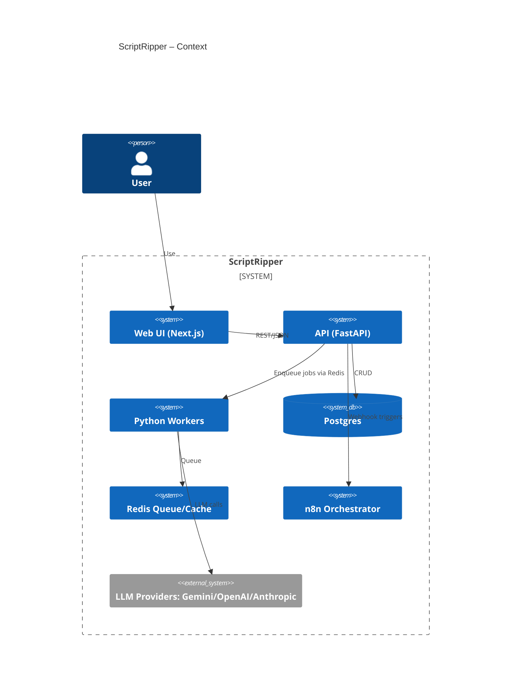
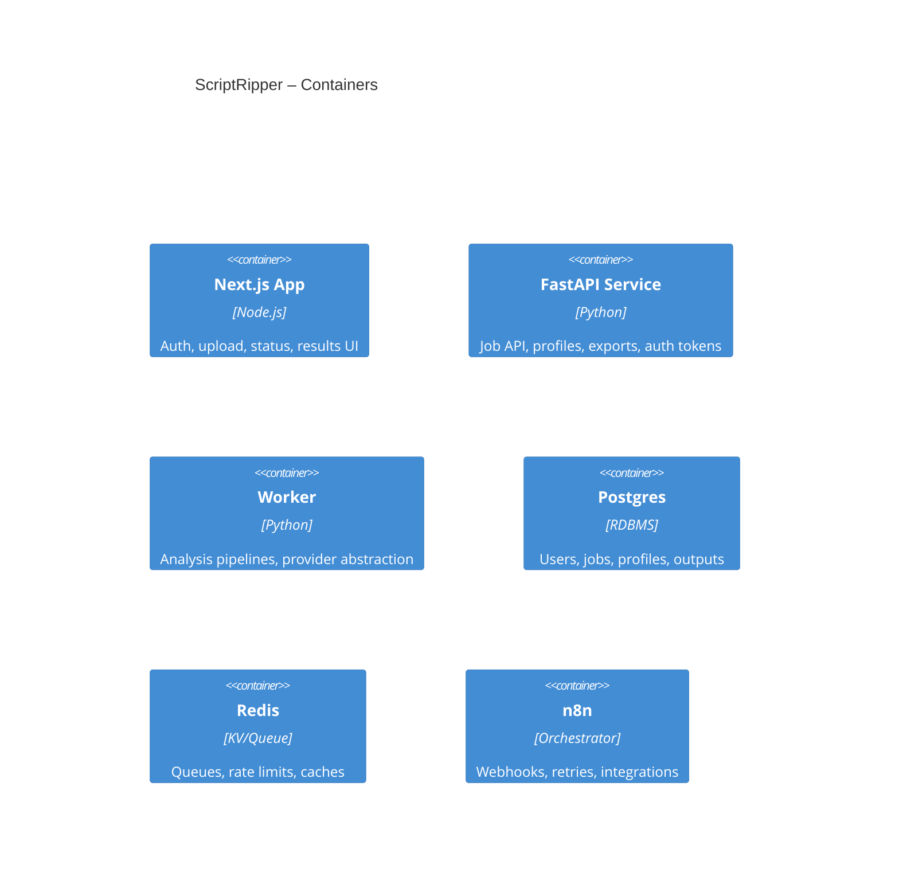

# ScriptRipper Technical Specification

## 1. TL;DR
ScriptRipper is a transcript analysis and filtering tool for both conversational (multi‑speaker meetings) and presentational (single‑speaker monologues). Users upload transcripts, select profiles/prompts, and receive curated outputs (highlights, decisions, tasks, summaries, quotables) with exports. This spec defines MVP → V1 scope, SLOs, security, and architecture to migrate from a Google Labs prototype to a provider‑agnostic, production web app with CLI and API.

## 2. Problem, Goals, Non‑Goals
**Problem.** Rewatching long recordings is wasteful; people need specific takeaways quickly.

**Goals (MUST)**
- Provide accurate, configurable extraction of highlights, tasks, topics, and quotables from transcripts.
- Support both single and multi‑speaker transcripts.
- Deliver web UI parity with headless CLI and simple API.
- Allow provider selection among Gemini, OpenAI, Anthropic.

**KPIs (business)**
- Paid conversion rate (trial→paid) ↑.
- Active memberships (MAU/paid) ↑.
- User satisfaction (CSAT) ≥ target.

**Non‑Goals (MVP)**
- Real‑time live meeting capture;
- Full multi‑tenant org hierarchy;
- Deep enterprise IAM/SSO;
- Audio diarization (assume external tools provide transcript + speaker tags).

## 3. Users & Use Cases
**Roles**: Admin, User. (No multi‑tenant orgs for MVP.)

**Primary users**: Creators, knowledge workers, agencies—anyone who prefers curated specifics over full rewatch.

### Acceptance Criteria (Gherkin)
**A. Upload → Profile → Analyze → Output**
```gherkin
Scenario: Run analysis for a single transcript
  Given I am an authenticated user
  And I have a transcript file with optional speaker labels
  When I choose a profile and start analysis
  Then a job is created and queued
  And within P95 latency the job completes
  And I can view/download a Markdown results pack with highlights, tasks, and quotables
```
```gherkin
Scenario: Multi-speaker handling
  Given a transcript with multiple speakers
  When analysis runs with a conversation-aware profile
  Then speaker-aware outputs MUST be generated (attribution preserved in results)
```
**B. Batch processing**
```gherkin
Scenario: Batch upload
  Given I select multiple transcripts
  When I start analysis
  Then the system MUST queue N jobs and expose per-item status
  And I can export a single ZIP with all results
```
**C. Profile management (CRUD + versioning)**
```gherkin
Scenario: Create a custom profile
  Given I am an Admin
  When I define prompts, parameters, and output schema
  Then the profile is versioned (immutable v1, v2...)
  And I can set a default and deprecate prior versions
```
**E. Export bundle**
```gherkin
Scenario: Export results
  Given a completed job
  When I request an export
  Then the system MUST provide ZIP and JSON exports with checksums
```
**F. Web UI parity**
```gherkin
Scenario: Use via web
  Given I am authenticated via magic link or Google OAuth
  When I use the web app
  Then I can perform all MVP flows equivalent to CLI/API
```
**G. CLI (headless)**
```gherkin
Scenario: Run via CLI
  Given I have API credentials
  When I run `scriptripper run --profile <id> --in *.json --out out/`
  Then the tool MUST submit jobs, poll status, and download outputs
```
**Custom user prompts**
```gherkin
Scenario: Ad-hoc prompt
  Given a completed job
  When I submit a custom prompt against the transcript/embeddings
  Then the system SHOULD generate an additional output page labeled and attached to the job
```

## 4. Success Metrics & SLOs
**SLIs**
- API success rate (2xx/ (2xx+5xx)).
- Job completion latency (create→completed) per transcript minute.
- Export availability.
- Prompt output satisfaction (thumbs‑up rate).

**SLO targets (MVP; subject to ADR if changed)**
- API success ≥ 99.5% monthly.
- Job latency: P95 ≤ 1× transcript duration; P99 ≤ 2×.
- Export generation success ≥ 99.0%.
- Error budget policy: alert when 25% of monthly error budget is spent; initiate rollback at 50%.

## 5. Scope & Phasing
**MVP (MUST)**: Flows A, B, C, E, F, G; custom user prompts; provider abstraction; email+link or Google OAuth; Admin/User roles.

**V1 (SHOULD)**: Batch presets, project history, richer share links, cost/quality routing policies, embeddings cache, profile marketplace.

**V-later (MAY)**: Multi‑tenant orgs, RBAC granularity, real‑time capture, enterprise SSO, fine‑tuned models.

## 6. Constraints & Assumptions
- Single‑tenant deployment; minimal PII (email, name).
- Transcripts are provided; diarization done upstream.
- Default regions: US; hosting on Vercel (web) + Render/Cloud Run (API/workers).
- Data retention: raw transcripts 30 days (configurable); derived outputs 180 days.
- Default orchestrator: n8n.
- Default DB: Postgres as SSOT; Redis for queues/cache.

## 7. Security, Privacy, Compliance
- **ASVS Level**: OWASP ASVS L2.
- **AuthN**: magic link (email) or Google OAuth.
- **AuthZ**: Admin/User. Admin can manage profiles; User can run jobs and manage their data.
- **Threat model (brief)**: protect API keys; mitigate prompt injection via output schemas and safelists; rate‑limit job creation; encrypt data at rest (DB) and in transit (TLS); signed URLs for downloads; scoped API tokens for CLI.
- **Privacy**: Minimize stored transcripts; allow user‑initiated purge.

## 8. Architecture Overview

### C4 Level 1: System Context


### C4 Level 2: Containers


**High‑level Data Model (summary)**
- `users(id, email, name, role)`
- `profiles(id, key, version, schema, prompts, status)`
- `jobs(id, user_id, profile_id, status, metrics, cost, created_at, completed_at)`
- `artifacts(id, job_id, kind, uri, checksum)`
- `custom_prompts(id, job_id, prompt, result_artifact_id)`

## 9. API & Data Contracts
**Principles**: REST, JSON; idempotency via `Idempotency-Key`; pagination via `cursor`.

- `POST /api/v1/jobs` – create job (file upload or transcript JSON). Returns `job_id`.
- `GET /api/v1/jobs/{id}` – status + metrics.
- `POST /api/v1/exports/{id}` – request ZIP/JSON export.
- `GET /api/v1/artifacts/{id}` – signed download.
- `GET /api/v1/profiles` – list profiles.
- `POST /api/v1/prompts` – run custom prompt against a completed job.

**Common Error Shape**
```json
{ "error": { "code": "string", "message": "string", "retryable": true } }
```

## 10. UX & Content
- Key states: empty, uploading, queued, running, completed, failed, exported.
- Accessibility: WCAG AA; keyboard navigable; clear status updates.
- Content tone: concise, actionable; show cost & provider badge per job.

## 11. Testing Strategy
- **Unit**: profiles schema validation; provider adapters; cost calculators.
- **Integration**: job creation→worker→artifact; exports; n8n webhooks.
- **E2E**: Cypress/Playwright flows for A, B, C, E, F, G.
- **Non‑functional**: load (queue saturation), chaos (LLM timeouts), security (auth bypass).

## 12. Observability & Ops
- **Metrics**: API success; job latency histograms; queue depth; LLM call rates/cost; export success.
- **Logs**: structured JSON with correlation IDs (trace/span).
- **Traces**: OpenTelemetry from web→api→worker→provider.
- **Alerts**: SLO burn rate; queue backlog; provider error surge; export failure.
- **Runbooks**: rotate provider keys; reroute to alternate model; drain/flush stuck jobs.

## 13. Release & Rollout
- Envs: `dev`, `staging`, `prod`.
- Feature flags: provider switching; profiles beta.
- Progressive delivery: canary on API; rollback via image pin.
- Migrations: Alembic (FastAPI/SQLModel or SQLAlchemy); backwards‑compatible.

## 14. Risks & Mitigations
- Provider instability → multi‑provider fallback; timeouts + retries.
- Cost spikes → quotas; per‑job caps; daily budget alerts.
- Prompt injection → output schema validation; escape & safelist.
- Long transcripts → chunking + embeddings cache.

## 15. Decision Log
- ADR‑0001 Stack Selection
- ADR‑0002 Orchestrator = n8n
- ADR‑0003 Provider Abstraction (Gemini/OpenAI/Anthropic)
- ADR‑0004 SSOT = Postgres
- ADR‑0005 Auth Model (Magic Link + Google OAuth)
- ADR‑0006 Hosting (Vercel + Render/Cloud Run)
- ADR‑0007 RBAC (Admin/User)

## 16. Roadmap & Work Plan
See `/ROADMAP.md`.

## 17. Glossary & References
- **Profile**: versioned prompt set with output schema.
- **Artifact**: generated file (md, json, zip) tied to a job.
- **Provider**: LLM vendor backend (Gemini, OpenAI, Anthropic).
